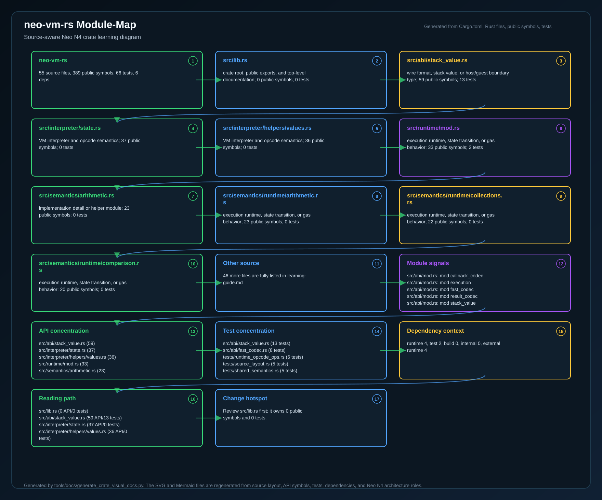
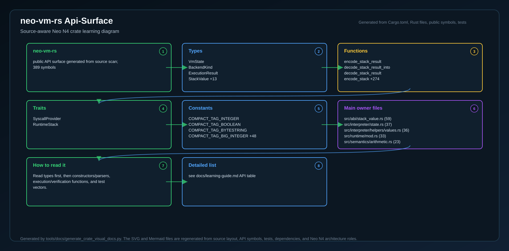
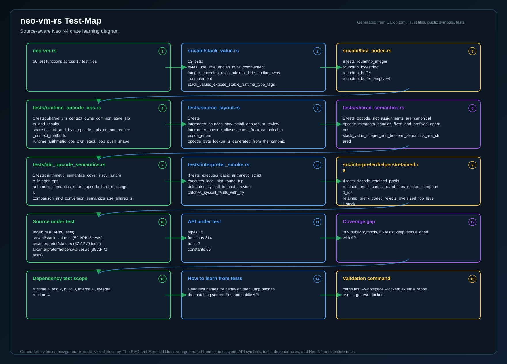
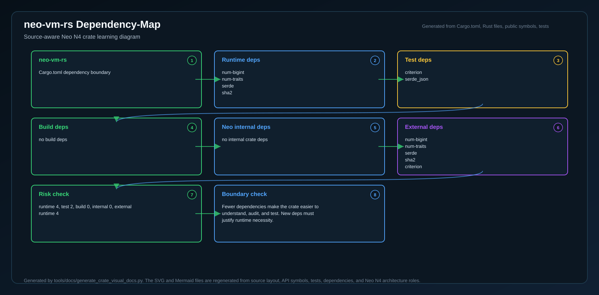
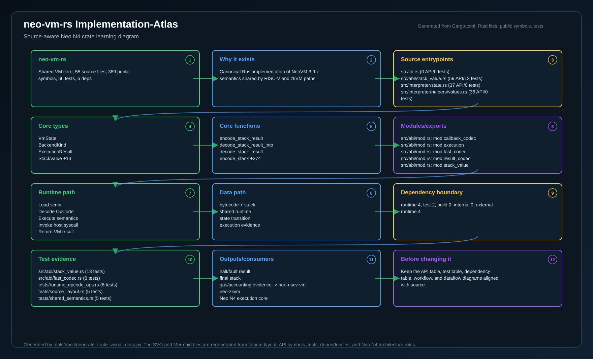

# neo-vm-rs

`neo-vm-rs` is the shared NeoVM semantics and interpreter crate used by the Neo
N4 Rust execution profile crates. It stays deterministic and `no_std + alloc`
compatible so PolkaVM/RISC-V runtimes and zkVM/proving runtimes can reuse the
same VM-facing types and execution behavior without inheriting each other's host
or prover stack.

## Scope

This crate owns the common semantics that must stay identical across N4 VM
consumers:

- canonical NeoVM opcode metadata and byte decoding
- shared execution result and VM state reporting types
- shared stack value representation used at ABI/proof boundaries
- shared Neo syscall hashing and fixed argument-count metadata
- shared execution limit constants
- the canonical NeoVM2 interpreter entry points used by the RISC-V guest facade

It does not contain a host runtime, storage engine, verifier, or prover. Those
remain in the consuming crates:

- `neo-riscv-vm`: canonical N4 Layer-2 NeoVM2/RISC-V execution profile
- `neo-zkvm`: proof-oriented zkVM integration and verifier tooling

## Layout

- `src/vm`: opcode metadata and execution constants
- `src/abi`: stack values and execution result wire types
- `src/interpreter`: no-std NeoVM2 interpreter, retained-state helpers, and
  host syscall trait
- `src/host`: syscall hash and stack argument metadata

## Validation

Run the same commands used by CI:

```powershell
cargo fmt --all -- --check
cargo clippy --all-targets --all-features -- -D warnings
cargo test --locked --all-targets
cargo check --locked --no-default-features --all-targets
cargo bench --locked --no-run
```

The test suite covers canonical opcode byte acceptance and gap rejection,
metadata round trips, syscall hash vectors, stack value conversion semantics,
serde wire compatibility for execution results, interpreter smoke execution,
slot handling, host syscall delegation, and try/catch exception flow.

It also includes the official Neo.VM VMUT corpus copied from
`neo-project/neo-vm` tag `v3.9.0`, the VM package used by the observed Neo N3
`neo-node v3.9.2` release line. The conformance runner executes 161 upstream
JSON fixture files, validates 723 executable `HALT`/`FAULT` cases, and counts
16 debugger-only `BREAK` cases as intentionally skipped because this crate does
not expose the C# step-debugger API. The runner mirrors Neo.VM's upstream VMUT
assertion behavior: `HALT` cases compare result stacks, while `FAULT` cases
compare final state and do not treat JSON stack fields as asserted behavior.

The benchmark target compiles Criterion benchmarks for opcode decode,
metadata lookup, syscall helpers, and stack value conversions. CI compiles the
benchmarks with `--no-run`; performance tracking jobs can run the same target on
dedicated hardware.

<!-- N4-CRATE-VISUAL-GUIDE:START -->

## Crate Visual Learning Guide

These diagrams are local to this crate. They explain `neo-vm-rs` as an independent unit: where it sits in the Neo N4 stack, which boundary it owns, how its internal workflow runs, and how data moves through it.

For the full source-level explanation, read [docs/learning-guide.md](docs/learning-guide.md).

| View | Diagram | Source |
| --- | --- | --- |
| Position in Neo N4 |  | [Mermaid](docs/figures/position.mmd) |
| Technical principles |  | [Mermaid](docs/figures/principles.mmd) |
| Architecture |  | [Mermaid](docs/figures/architecture.mmd) |
| Workflow |  | [Mermaid](docs/figures/workflow.mmd) |
| Dataflow |  | [Mermaid](docs/figures/dataflow.mmd) |
| Module map |  | [Mermaid](docs/figures/module-map.mmd) |
| Public API surface |  | [Mermaid](docs/figures/api-surface.mmd) |
| Test evidence |  | [Mermaid](docs/figures/test-map.mmd) |
| Dependency map |  | [Mermaid](docs/figures/dependency-map.mmd) |
| Implementation atlas |  | [Mermaid](docs/figures/implementation-atlas.mmd) |

### Role in Neo N4

- **Layer:** Shared VM core
- **Purpose:** Canonical Rust implementation of NeoVM 3.9.x semantics shared by RISC-V and zkVM paths.
- **Primary inputs:** NeoVM bytecode, initial stack, syscall host callbacks
- **Primary outputs:** halt/fault result, final stack, gas/accounting evidence
- **Downstream consumers:** neo-riscv-vm, neo-zkvm, Neo N4 execution core
- **Source files scanned:** 55
- **Public symbols scanned:** 389
- **Rust tests scanned:** 66

### Boundary and Responsibilities

- **Owns:** Decode canonical opcodes, Execute stack and state semantics, Expose reusable runtime APIs
- **Consumes:** NeoVM bytecode, initial stack, syscall host callbacks
- **Produces:** halt/fault result, final stack, gas/accounting evidence
- **Used by:** neo-riscv-vm, neo-zkvm, Neo N4 execution core

### Source Map Snapshot

| File | Why it matters | Public API | Tests |
| --- | --- | ---: | ---: |
| `src/lib.rs` | crate root, public exports, and top-level documentation | 0 | 0 |
| `src/abi/stack_value.rs` | wire format, stack value, or host/guest boundary type | 59 | 13 |
| `src/interpreter/state.rs` | VM interpreter and opcode semantics | 37 | 0 |
| `src/interpreter/helpers/values.rs` | VM interpreter and opcode semantics | 36 | 0 |
| `src/runtime/mod.rs` | execution runtime, state transition, or gas behavior | 33 | 2 |
| `src/semantics/arithmetic.rs` | implementation detail or helper module | 23 | 0 |
| `src/semantics/runtime/arithmetic.rs` | execution runtime, state transition, or gas behavior | 23 | 0 |
| `src/semantics/runtime/collections.rs` | execution runtime, state transition, or gas behavior | 22 | 0 |

### API Snapshot

| Kind | Representative symbols |
| --- | --- |
| Types | VmState <br> BackendKind <br> ExecutionResult <br> StackValue +13 |
| Functions | encode_stack_result <br> decode_stack_result_into <br> decode_stack_result <br> encode_stack +274 |
| Trait | SyscallProvider <br> RuntimeStack |
| Constants | COMPACT_TAG_INTEGER <br> COMPACT_TAG_BOOLEAN <br> COMPACT_TAG_BYTESTRING <br> COMPACT_TAG_BIG_INTEGER +48 |

### Learning Path

1. Start with the position diagram to understand why this crate exists and who calls it.
2. Read the technical principles diagram to identify the invariants and responsibility boundary.
3. Use the module map and API surface to identify the files and symbols to read first.
4. Follow the workflow, dataflow, test, and dependency diagrams before changing code.
5. Use the implementation atlas as the compact source-reading map when you want one dense view instead of separate technical views.

<!-- N4-CRATE-VISUAL-GUIDE:END -->
