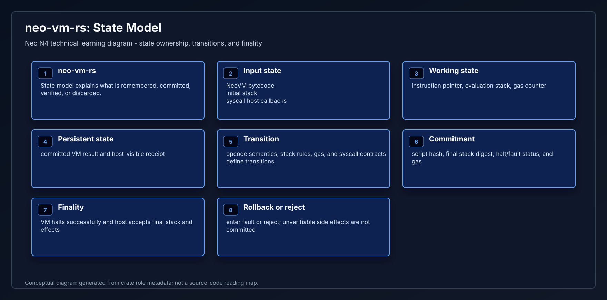
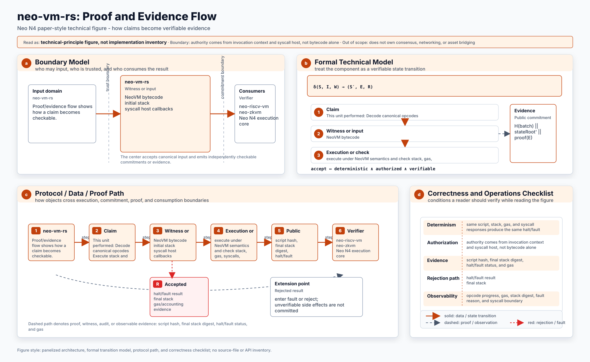
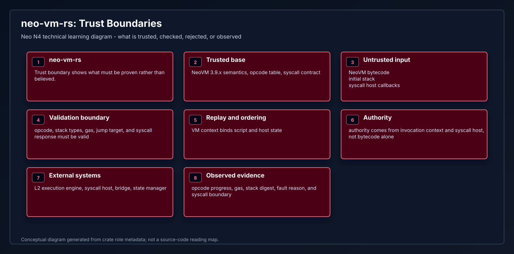
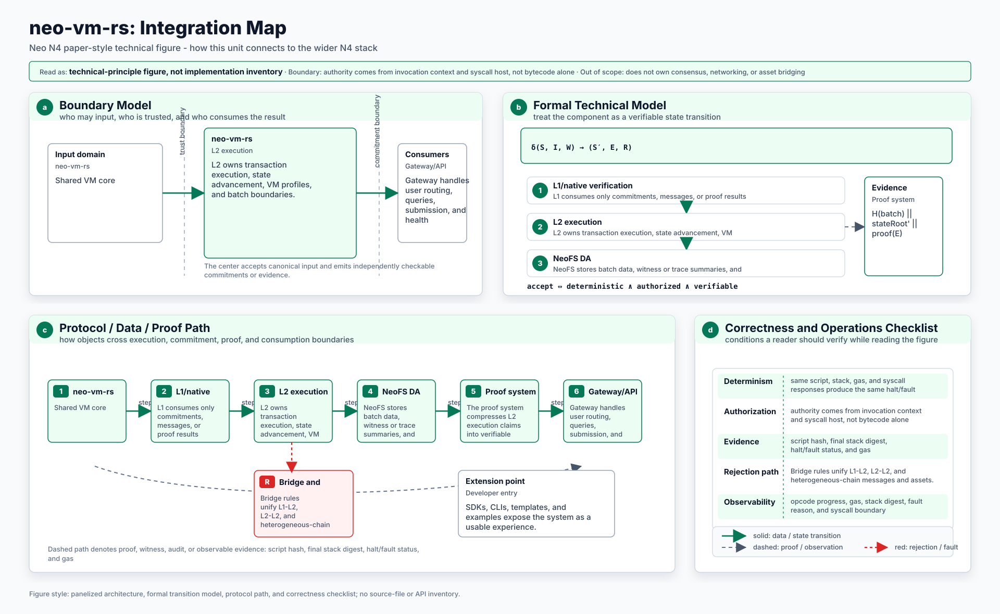
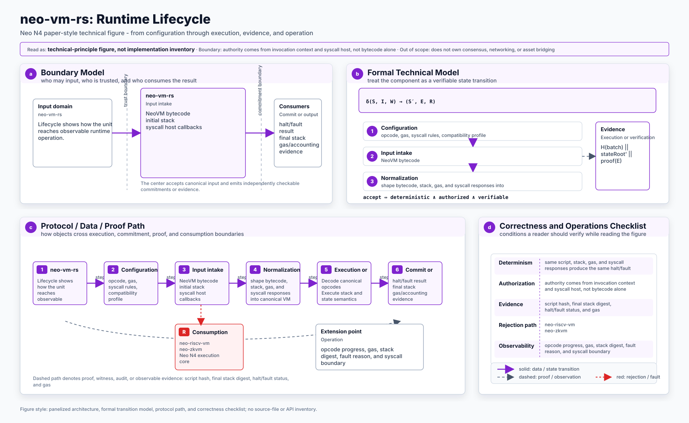

# neo-vm-rs

`neo-vm-rs` is the shared NeoVM semantics and interpreter crate used by the Neo
N4 Rust execution profile crates. It stays deterministic and `no_std + alloc`
compatible so PolkaVM/RISC-V runtimes and zkVM/proving runtimes can reuse the
same VM-facing types and execution behavior without inheriting each other's host
or prover stack.

## Scope

This crate owns the common semantics that must stay identical across N4 VM
consumers:

- canonical NeoVM opcode metadata and byte decoding
- shared execution result and VM state reporting types
- shared stack value representation used at ABI/proof boundaries
- shared Neo syscall hashing and fixed argument-count metadata
- shared execution limit constants
- the canonical NeoVM2 interpreter entry points used by the RISC-V guest facade

It does not contain a host runtime, storage engine, verifier, or prover. Those
remain in the consuming crates:

- `neo-riscv-vm`: canonical N4 Layer-2 NeoVM2/RISC-V execution profile
- `neo-zkvm`: proof-oriented zkVM integration and verifier tooling

## Layout

- `src/vm`: opcode metadata and execution constants
- `src/abi`: stack values and execution result wire types
- `src/interpreter`: no-std NeoVM2 interpreter, retained-state helpers, and
  host syscall trait
- `src/host`: syscall hash and stack argument metadata

## Validation

Run the same commands used by CI:

```powershell
cargo fmt --all -- --check
cargo clippy --all-targets --all-features -- -D warnings
cargo test --locked --all-targets
cargo check --locked --no-default-features --all-targets
cargo bench --locked --no-run
```

The test suite covers canonical opcode byte acceptance and gap rejection,
metadata round trips, syscall hash vectors, stack value conversion semantics,
serde wire compatibility for execution results, interpreter smoke execution,
slot handling, host syscall delegation, and try/catch exception flow.

It also includes the official Neo.VM VMUT corpus copied from
`neo-project/neo-vm` tag `v3.9.0`, the VM package used by the observed Neo N3
`neo-node v3.9.2` release line. The conformance runner executes 161 upstream
JSON fixture files, validates 723 executable `HALT`/`FAULT` cases, and counts
16 debugger-only `BREAK` cases as intentionally skipped because this crate does
not expose the C# step-debugger API. The runner mirrors Neo.VM's upstream VMUT
assertion behavior: `HALT` cases compare result stacks, while `FAULT` cases
compare final state and do not treat JSON stack fields as asserted behavior.

The benchmark target compiles Criterion benchmarks for opcode decode,
metadata lookup, syscall helpers, and stack value conversions. CI compiles the
benchmarks with `--no-run`; performance tracking jobs can run the same target on
dedicated hardware.

<!-- N4-CRATE-VISUAL-GUIDE:START -->
## Technical Visual Guide

These diagrams are local to this crate and explain `neo-vm-rs` at the technical architecture level. They focus on system role, principles, data movement, workflow, state, proof/evidence, trust boundaries, integration, and runtime lifecycle.

Full technical explanation: [docs/learning-guide.md](docs/learning-guide.md).

| View | Diagram | Mermaid |
| --- | --- | --- |
| System Position |  | [Mermaid](docs/figures/position.mmd) |
| Technical Principles |  | [Mermaid](docs/figures/principles.mmd) |
| Conceptual Architecture |  | [Mermaid](docs/figures/architecture.mmd) |
| Workflow |  | [Mermaid](docs/figures/workflow.mmd) |
| Data Flow |  | [Mermaid](docs/figures/dataflow.mmd) |
| State Model |  | [Mermaid](docs/figures/state-model.mmd) |
| Proof and Evidence Flow |  | [Mermaid](docs/figures/proof-flow.mmd) |
| Trust Boundaries |  | [Mermaid](docs/figures/trust-boundaries.mmd) |
| Integration Map |  | [Mermaid](docs/figures/integration-map.mmd) |
| Runtime Lifecycle |  | [Mermaid](docs/figures/lifecycle.mmd) |

### Technical Role

- **Layer:** Shared VM core
- **Purpose:** Canonical Rust implementation of NeoVM 3.9.x semantics shared by RISC-V and zkVM paths.
- **Inputs:** NeoVM bytecode | initial stack | syscall host callbacks
- **Responsibilities:** Decode canonical opcodes | Execute stack and state semantics | Expose reusable runtime APIs
- **Outputs:** halt/fault result | final stack | gas/accounting evidence
- **Consumers:** neo-riscv-vm | neo-zkvm | Neo N4 execution core

### Reading Order

1. Start with system position and conceptual architecture.
2. Read technical principles, trust boundaries, and state model to understand correctness.
3. Follow workflow and dataflow to see runtime movement.
4. Use proof/evidence flow, integration map, and lifecycle for operational understanding.
<!-- N4-CRATE-VISUAL-GUIDE:END -->
