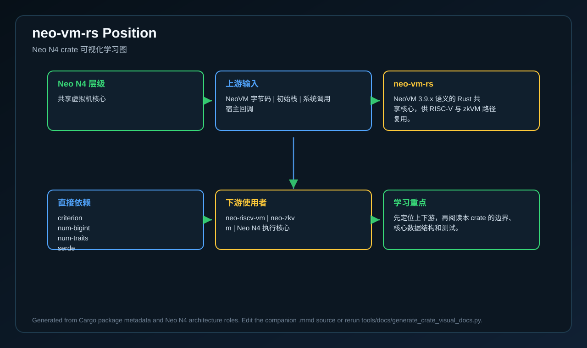
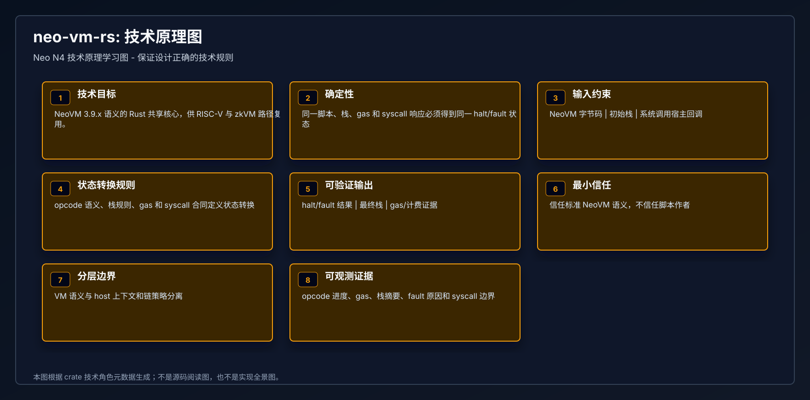
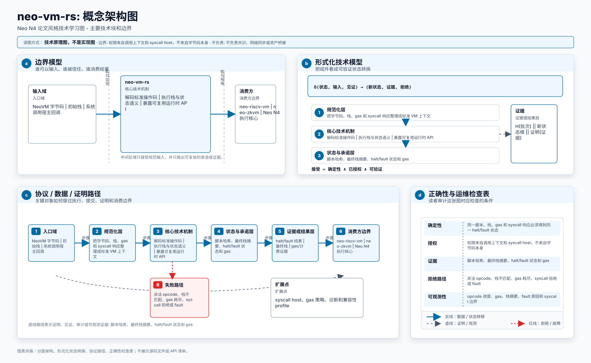
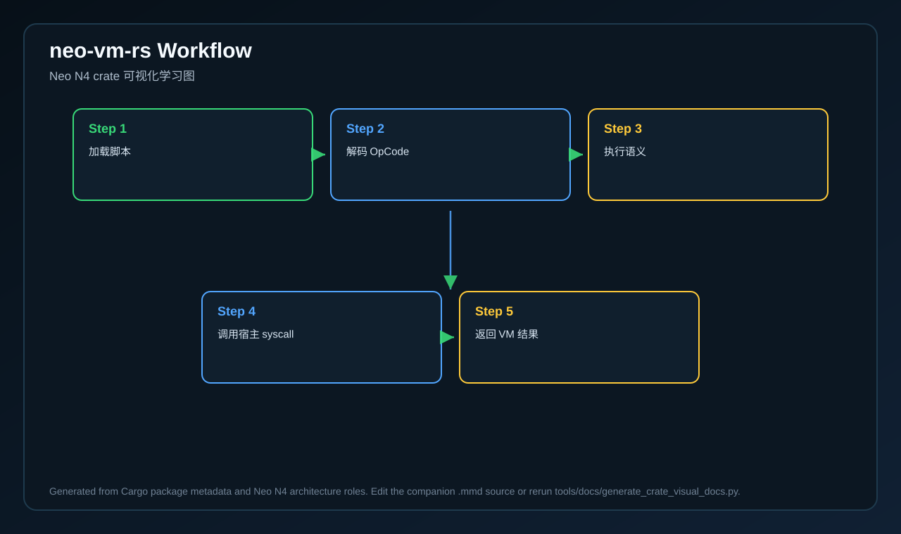
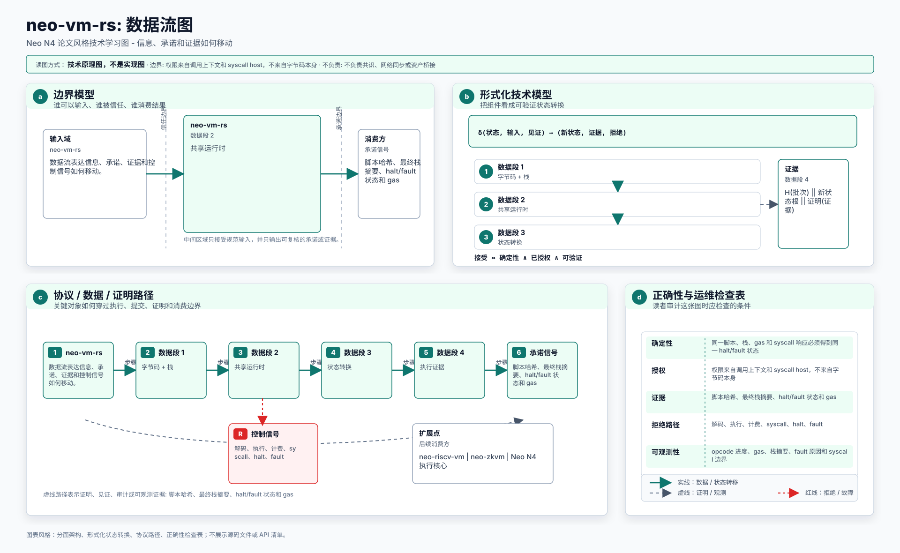
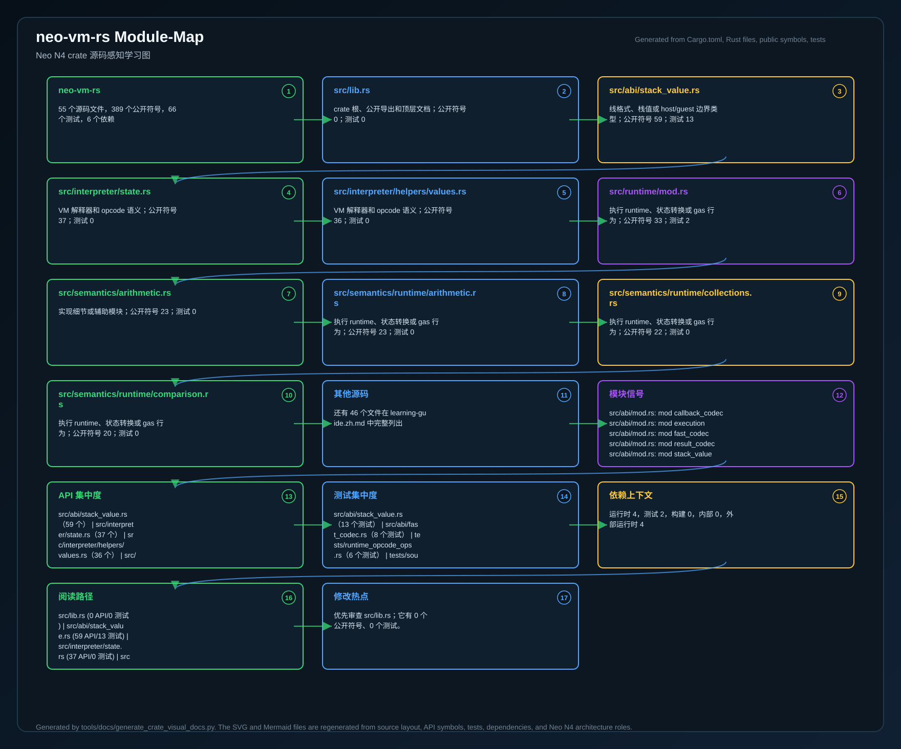
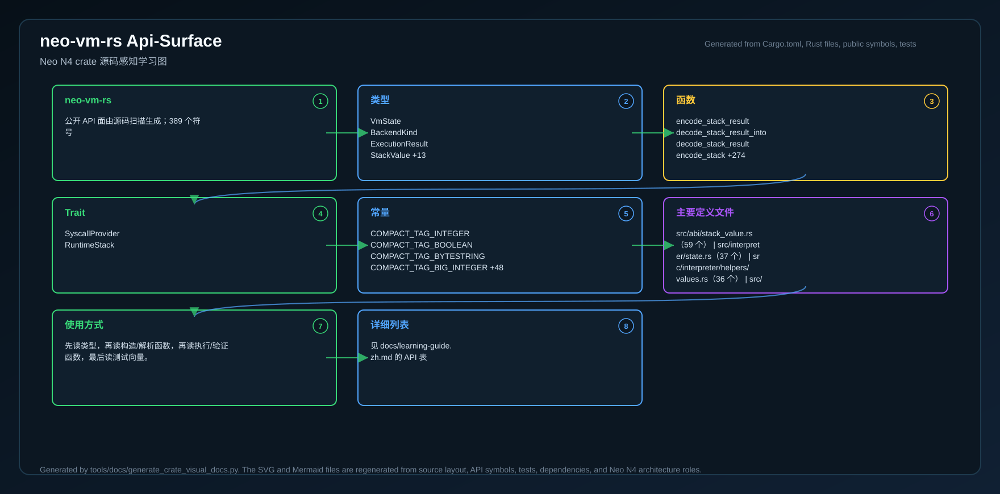
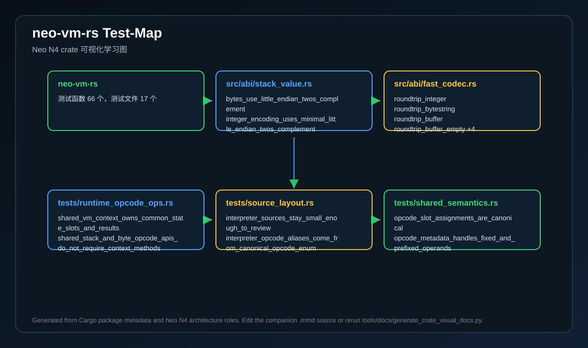
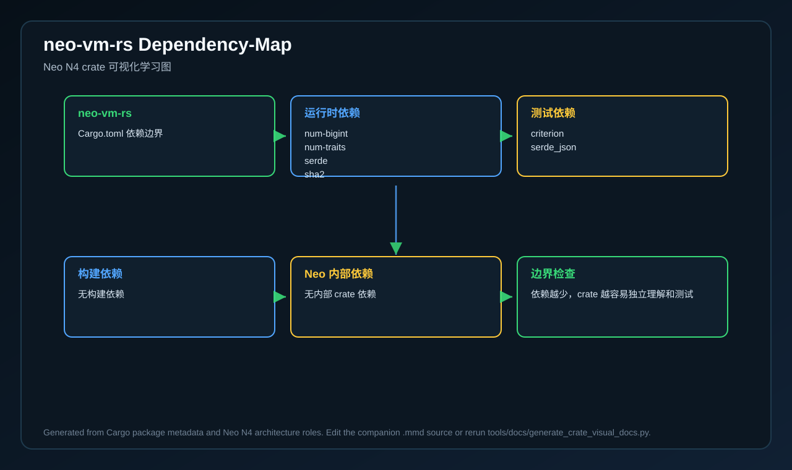

# neo-vm-rs

<!-- N4-CRATE-VISUAL-GUIDE-ZH:START -->

## 可视化学习指南

这些图是 `neo-vm-rs` 自己目录下的 crate 专属学习资料，用来说明它在 Neo N4 中的位置、自己负责的技术边界、内部工作流，以及数据如何流经它。

完整的源码级解释见 [docs/learning-guide.zh.md](docs/learning-guide.zh.md)。

| 视图 | 图片 | 源文件 |
| --- | --- | --- |
| 在 Neo N4 中的位置 |  | [Mermaid](docs/figures/position.zh.mmd) |
| 技术原理 |  | [Mermaid](docs/figures/principles.zh.mmd) |
| 架构 |  | [Mermaid](docs/figures/architecture.zh.mmd) |
| 工作流 |  | [Mermaid](docs/figures/workflow.zh.mmd) |
| 数据流 |  | [Mermaid](docs/figures/dataflow.zh.mmd) |
| 模块图 |  | [Mermaid](docs/figures/module-map.zh.mmd) |
| 公开 API 图 |  | [Mermaid](docs/figures/api-surface.zh.mmd) |
| 测试证据图 |  | [Mermaid](docs/figures/test-map.zh.mmd) |
| 依赖图 |  | [Mermaid](docs/figures/dependency-map.zh.mmd) |

### 在 Neo N4 中的作用

- **层级:** 共享虚拟机核心
- **目的:** NeoVM 3.9.x 语义的 Rust 共享核心，供 RISC-V 与 zkVM 路径复用。
- **主要输入:** NeoVM 字节码、初始栈、系统调用宿主回调
- **主要输出:** halt/fault 结果、最终栈、gas/计费证据
- **下游使用者:** neo-riscv-vm、neo-zkvm、Neo N4 执行核心
- **扫描到的源码文件:** 55
- **扫描到的公开符号:** 389
- **扫描到的 Rust 测试:** 66

### 边界与职责

- **本 crate 负责:** 解码标准操作码、执行栈与状态语义、暴露可复用运行时 API
- **本 crate 消费:** NeoVM 字节码、初始栈、系统调用宿主回调
- **本 crate 产出:** halt/fault 结果、最终栈、gas/计费证据
- **主要被谁使用:** neo-riscv-vm、neo-zkvm、Neo N4 执行核心

### 源码地图快照

| 文件 | 为什么重要 | 公开 API | 测试 |
| --- | --- | ---: | ---: |
| `src/lib.rs` | crate 根、公开导出和顶层文档 | 0 | 0 |
| `src/abi/stack_value.rs` | 线格式、栈值或 host/guest 边界类型 | 59 | 13 |
| `src/interpreter/state.rs` | VM 解释器和 opcode 语义 | 37 | 0 |
| `src/interpreter/helpers/values.rs` | VM 解释器和 opcode 语义 | 36 | 0 |
| `src/runtime/mod.rs` | 执行 runtime、状态转换或 gas 行为 | 33 | 2 |
| `src/semantics/arithmetic.rs` | 实现细节或辅助模块 | 23 | 0 |
| `src/semantics/runtime/arithmetic.rs` | 执行 runtime、状态转换或 gas 行为 | 23 | 0 |
| `src/semantics/runtime/collections.rs` | 执行 runtime、状态转换或 gas 行为 | 22 | 0 |

### API 快照

| 类型 | 代表符号 |
| --- | --- |
| 类型 | VmState   BackendKind   ExecutionResult   StackValue +13 |
| 函数 | encode_stack_result   decode_stack_result_into   decode_stack_result   encode_stack +274 |
| Trait | SyscallProvider   RuntimeStack |
| 常量 | COMPACT_TAG_INTEGER   COMPACT_TAG_BOOLEAN   COMPACT_TAG_BYTESTRING   COMPACT_TAG_BIG_INTEGER +48 |

### 学习路径

1. 先看位置图，明确这个 crate 为什么存在、上游是谁、下游是谁。
2. 再看技术原理图，理解它的核心不变量、职责边界和维护规则。
3. 然后看模块图和 API 图，确定先读哪些文件、哪些符号。
4. 最后看工作流、数据流、测试证据图和依赖图，再进入源码会更容易理解。

<!-- N4-CRATE-VISUAL-GUIDE-ZH:END -->
